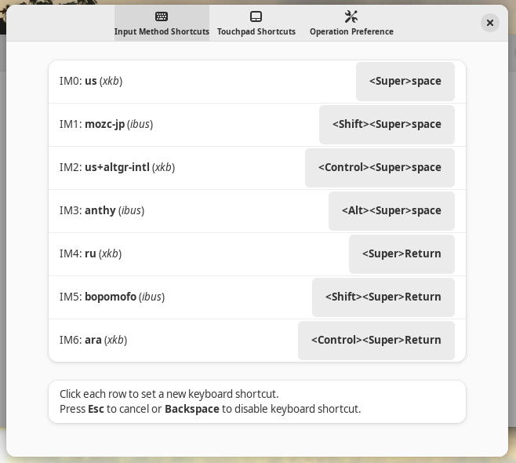
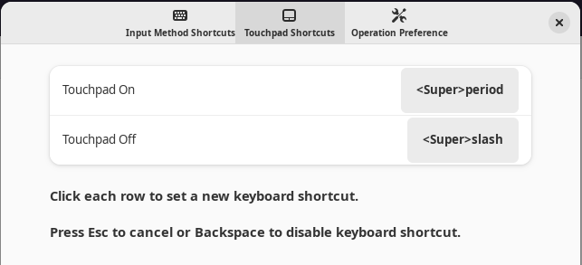
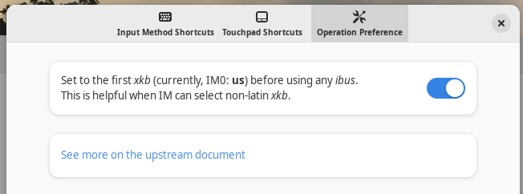
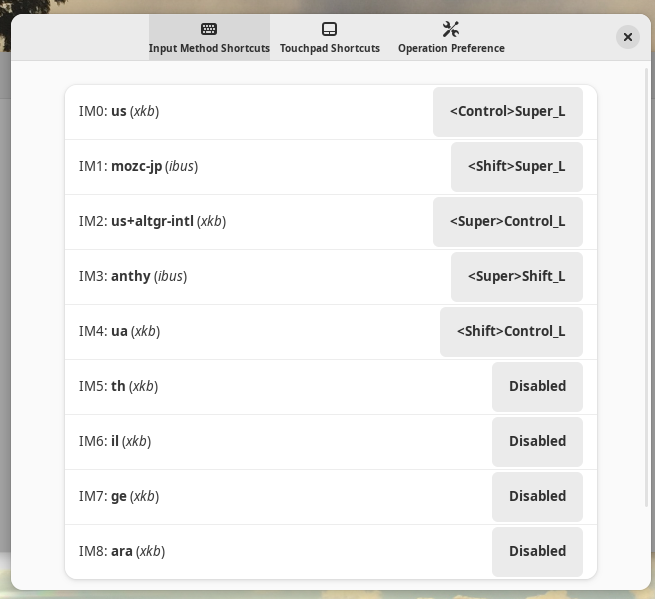

Quick switching of input method and touchpad
============================================

This is a GNOME shell extension which allows us to set up custom keyboard
shortcuts for:
- quick switching of input method (first 10 available ones) and
- quick switching of touchpad.

This can make keyboard input experiences quick (pop-up-less), non-interfering,
stateless and deterministic while keeping the original behavior available (if
you wish).  This shortcut can automatically sets xkb to the first one before
entering ibus input method.  (This default setting fixes issues of ibus with
non-latin inputs such as xkb=ru etc. This is a configurable feature.)

I found "Disable While Typing" (in GNOME "Tweaks" -> "Keyboard & Mouse" ->
"Touchpad") is not perfect solution. Keyboard shortcuts can ensure you to avoid
touchpad interferences with minimal user efforts.

If you happen to have more than 10 input methods, they can be used through the
normal center selection panel if you don't intentionally disable pertinent
shortcuts.  If you intentionally disable such shortcuts, these convenient
keys can be used by this extension.

Due to the difference of support for `use_markup`, I make 2 packages depending
on target GNOME versions: one for GNOME 40-42, another for GNOME 43 and 44.

Due to the
[major change in GNOME 45](https://blogs.gnome.org/shell-dev/2023/09/02/extensions-in-gnome-45/),
this source code was ported to standard JavaScript modules (ESM) by Álan
Crístoffer to support GNOME 45 and after.

## Usage

First, you must set up all your input methods from GNOME GUI:

- `Settings` -> `Keyboard` -> `Input Sources` etc.

Then install this GNOME extensions using your browser from the GNOME extensions site:

- https://extensions.gnome.org/extension/6066/shortcuts-to-activate-input-methods/

Afterwards, restart the GNOME shell by log-out and log-in from GUI.  You can
also use CLI `killall gnome-shell` to log out.  This is essential process to
get GNOME shell extensions to function as expected.

Then, enable this extension from GUI, e.g., `gnome-extensions-app`
(**Extensions**) in GNOME 43 or later; or from **GNOME Tweaks** menu in older
GNOME. You must set up each shortcut first to use this extension.

The pre-exiting shortcut key can't be reused.  You must disable their usage
first, elsewhere.

If you change installed input methods, you must restart this extension.

### Input Method Shortcuts (example screenshot)



Here, I disabled `<Super>Space` and `<Super><Shift>Space` usages in "Settings"
-> "Keyboard" -> "Keyboard shortcuts" -> "Typing" before setting up as above.

Please note that, if an ibus can offer its internal shortcuts to activate input
method engine (IME) and to deactivate IME by using direct input mode just with
xkb for latin character set, switching between IME and direct input mode within
ibus is quicker than using Desktop based input method switching functionality
handled by this extension.

### Touchpad Shortcuts (example screenshot)



Please note that you don't need to set all shortcut bindings.

### Operation Preference (example screenshot)



### Ideas for other shortcut keys

Here are other ideas for shortcut keys.

- `<Super>u` (**u** for US)
- `<Super>i` (**i** for International)
- `<Super>j` (**j** for Japanese)
- `<Super>k` (**k** for Korean)
- `<Super>c` (**c** for Chinese)
- `<Super>z` (**z** for Chinese=zh)

Even unusual key combos of Modifierkeys can be used as shortcuts.

- `<Shift>Shift_R` -- Press `Shift_L` then press `Shift_R`
- `<Shift>Shift_L` -- Press `Shift_R` then press `Shift_L`
- `<Shift>Caps_Lock`
- `<Control>Shift_R`
- `<Control>Shift_L`
- `<Control>Caps_Lock`
- `<Alt>Shift_R`
- `<Alt>Shift_L`
- `<Alt>Caps_Lock`
- `<Super>Shift_R`
- `<Super>Shift_L`
- `<Super>Caps_Lock`
...

If some other program already binds a key combination for shortcut, that key
combination can't be registered.  (Using `Alt_R` key as the 2nd key part for
these combos of Modifierkeys is not a good idea due to many complications.)

For example, I ended up keeping original input method switching with
`<Super>space` by using:



Here, I use "US, intl., with AltGr dead keys" (`us+altgr-intl`) to enter
accented latin characters.  This is less stressful method than "US, intl., with
dead keys" which functions like the default Windows international environment.

### Ways to reorder input methods

If you have multiple xkb methods, you may need to reorder input methods so the
first xkb method may be set as the preferred one for ibus input methods via
quick CLI.

```sh
$ gsettings get org.gnome.desktop.input-sources sources
[('xkb', 'ru'), ('xkb', 'us'), ('ibus', 'anthy'), ('ibus', 'mozc-jp'), ('xkb', 'us+altgr-intl')]
$ gsettings set org.gnome.desktop.input-sources sources "[('xkb', 'us'), ('ibus', 'mozc-jp'), ('xkb', 'us+altgr-intl'), ('ibus', 'anthy'), ('xkb', 'ru')]"
$ gsettings get org.gnome.desktop.input-sources sources
[('xkb', 'us'), ('ibus', 'mozc-jp'), ('xkb', 'us+altgr-intl'), ('ibus', 'anthy'), ('xkb', 'ru')]
```

## Development

The latest development version is available at:

  https://github.com/osamuaoki/inputmethod-shortcuts

Branch:
* `main`: support for GNOME 45 and after (version 22)
* `backport43`: support for GNOME 43 - 44 (version 21)
* `backport`: support for GNOME 40 - 42 (version 20)

(The version is set by GNOME extension site when a zip file is uploaded.)

You can install this extension for testing by:

```sh
$ git clone https://github.com/osamuaoki/inputmethod-shortcuts
$ cd inputmethod-shortcuts
$ make install
```

This will install files into your `
~/.local/share/gnome-shell/extensions/inputmethod-shortcuts@osamu.debian.org`
directory.

Afterwards, restart the GNOME shell by log-out and log-in from GUI.  You can
also use CLI `killall gnome-shell` to log out.  This is essential process to
get GNOME shell extension to function as expected.

This code was started to be based on similar GNOME shell extensions and
previous method to switch input methods:
 - https://github.com/matthijskooijman/gnome-shell-more-keyboard-shortcuts
 - https://gitlab.com/paddatrapper/shortcuts-gnome-extension (IGNORE_AUTOREPEAT)
 - https://www.mail-archive.com/gnome-shell-list@gnome.org/msg08988.html (previous method)

Resulting extension code was useful and functional for me but it had many rough
edges since this was my first javascript program without even reading its
references. Prior to getting this accepted by GNOME extension site,
**JustPerfection** guided me to fix such rough edges by making me to rewrite
practically the whole code.  Then, I rewrote whole code using ES6 style and
added touchpad controls.

For touchpad, I wanted to have 2 independent shortcuts to turn it on and off.
So I added them to this extension.  Since making toggling available was
trivial, I added it, too.  But I am not using it.

See [Keyboard shortcut customization (Input Method)](https://osamuaoki.github.io/en/2023/02/25/debian-usability-2023/#keyboard-shortcut-customization-input-method)
and [GNOME shell extension for input methods](https://osamuaoki.github.io/en/2023/06/19/gnome-im-1/)
for how I came to this extension.

License
=======
Copyright (c) 2023 Osamu Aoki <osamu@debian.org>

    This program is free software; you can redistribute it and/or modify
    it under the terms of the GNU General Public License as published by
    the Free Software Foundation; either version 2 of the License, or
    (at your option) any later version.

    This program is distributed in the hope that it will be useful,
    but WITHOUT ANY WARRANTY; without even the implied warranty of
    MERCHANTABILITY or FITNESS FOR A PARTICULAR PURPOSE.  See the
    GNU General Public License for more details.

    You should have received a copy of the GNU General Public License along
    with this program; if not, write to the Free Software Foundation, Inc.,
    51 Franklin Street, Fifth Floor, Boston, MA 02110-1301 USA.

[GPL2+](LICENSE)

