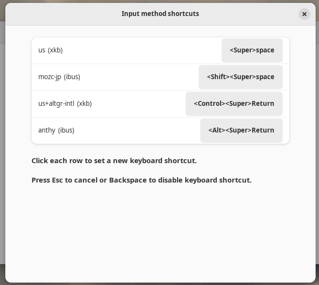

Quick keyboard switching among input methods
============================================

This is a GNOME shell extension that adds custom keyboard shortcuts
to up to first 10 available input methods under GNOME shell.

## Usage

You first must set up all your input methods from GNOME GUI:

- `Settings` -> `Keyboard` -> `Input Sources` etc.

Then install this GNOME extensions using your browser from the GNOME extensions site:

- https://extensions.gnome.org/extension/6066/shortcuts-to-activate-input-methods/

Afterwards, restart the GNOME shell by log-out and log-in from GUI.  You can
also use CLI `killall gnome-shell` to log out.  This is essential process to
get GNOME shell extension to function as expected.

Then, enable this extension from GUI, e.g., `gnome-extensions-app` (**Extensions**)
in GNOME 43; or from **GNOME tweak** menu in older GNOME.




You can set each input method to any unused shortcut keys as you wish.  For example, I can think of:

- `<Super>Space` (easy access - after disabling it in "Keyboard shortcuts" -> "Typing")
- `<Super><Shift>Space` (easy access - after disabling it in "Keyboard shortcuts" -> "Typing")
- `<Super><Control>Space` (easy access)
- `<Super><Alt>Space` (easy access)
- `<Super>Return` (easy access)
- `<Super><Shift>Return` (easy access)
- `<Super><Control>Return` (easy access)
- `<Super><Alt>Return` (easy access)
- `<Super>u` (**u** for US)
- `<Super>i` (**i** for International)
- `<Super>j` (**j** for Japanese)
- `<Super>k` (**k** for Korean)
- `<Super>z` (**z** for Chinese=zh)

These shortcuts will enable direct quick switching of the input method without slow menu selection.

If you happen to have more than 10 input methods, they can be used through the normal center selection panel.

(I only tested this for GNOME 43 but this extension should work for older version if version is ignored.)

## Development

The latest development version is available at:

  https://github.com/osamuaoki/inputmethod-shortcuts

You can install this extension for testing by:

```sh
$ git clone https://github.com/osamuaoki/inputmethod-shortcuts
$ cd inputmethod-shortcuts
$ make install
```

This will install files into your `
~/.local/share/gnome-shell/extensions/inputmethod-shortcuts@osamu.debian.org`
directory.

Afterwards, restart the GNOME shell by log-out and log-in from GUI.  You can
also use CLI `killall gnome-shell` to log out.  This is essential process to
get GNOME shell extension to function as expected.


If you want to reorder input method for any reason, here is a esy way:

```sh
$ gsettings get org.gnome.desktop.input-sources sources
[('xkb', 'us'), ('ibus', 'anthy'), ('ibus', 'mozc-jp'), ('xkb', 'us+altgr-intl')]
$ gsettings set org.gnome.desktop.input-sources sources "[('xkb', 'us'), ('ibus', 'mozc-jp'), ('xkb', 'us+altgr-intl'), ('ibus', 'anthy')]"
$ gsettings get org.gnome.desktop.input-sources sources
[('xkb', 'us'), ('ibus', 'mozc-jp'), ('xkb', 'us+altgr-intl'), ('ibus', 'anthy')]
```

This code was started to be based on similar GNOME shell extensions and
previous method to switch input methods:
 - https://github.com/matthijskooijman/gnome-shell-more-keyboard-shortcuts
 - https://gitlab.com/paddatrapper/shortcuts-gnome-extension (IGNORE_AUTOREPEAT)
 - https://www.mail-archive.com/gnome-shell-list@gnome.org/msg08988.html (previous method)

Resulting extension code was useful and functional for me but it had many rough
edges since this was my first javascript program without even reading its
references. Prior to getting this accepted by GNOME extension site,
**JustPerfection** guided me to fix such rough edges by making me to rewrite
practically the whole code.

See [Keyboard shortcut customization (Input Method)](https://osamuaoki.github.io/en/2023/02/25/debian-usability-2023/#keyboard-shortcut-customization-input-method)
and [GNOME shell extension for input methods](https://osamuaoki.github.io/en/2023/06/19/gnome-im-1/)
for how I came to this extension.

License
=======
Copyright (c) 2023 Osamu Aoki <osamu@debian.org>

    This program is free software; you can redistribute it and/or modify
    it under the terms of the GNU General Public License as published by
    the Free Software Foundation; either version 2 of the License, or
    (at your option) any later version.

    This program is distributed in the hope that it will be useful,
    but WITHOUT ANY WARRANTY; without even the implied warranty of
    MERCHANTABILITY or FITNESS FOR A PARTICULAR PURPOSE.  See the
    GNU General Public License for more details.

    You should have received a copy of the GNU General Public License along
    with this program; if not, write to the Free Software Foundation, Inc.,
    51 Franklin Street, Fifth Floor, Boston, MA 02110-1301 USA.

[GPL2+](LICENSE)

